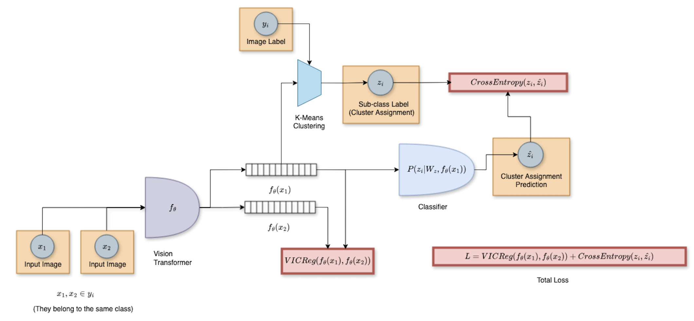
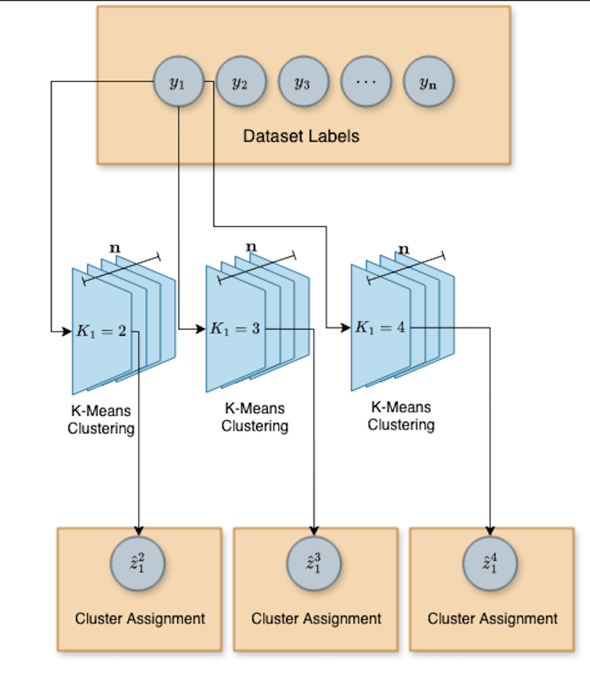

# FGDCC: Fine-Grained Deep Cluster Categorization - An Architecture for Intra-Class Variability in Problems in FGVC tasks

FGDCC is a method developed to tackle intra-class variability problems in fine-grained visual categorization (FGVC) tasks. It tries to leverage the original dataset labels to find  latent degrees of intra-class variability via class-wise clustering. We then train the model to predict the cluster prototypes obtained through K-Means assignments.  

As opposed to many deep clustering pipelines that uses autoencoder bottleneck features to perform clustering we use VICReg regularization to enforce an L2 norm friendly space in which we can naturally perform K-Means clustering. This is a trick in which we sample images that belongs to the same class, run them to the network to extract representations and then compute VICReg between these representations. This ends up constraining the model to learn classification features in whereas the euclidian distance between samples from the same class are preserved.

VICReg regularization was both an insight from the work of Ravid Shwarz that demonstrates that SSL enforces natural clusters with respect to semantical labels, and an empirical validation by observing that applying our method (without any regularization) to ImageNet-based pre-training, the K-Means loss increased over the epochs, therefore denoting that the euclidian distance between the representations were increasing throughout the fine-tuning process. 

  

### Accounting for multiple K hypotheses:

  

---

### Requirements
* Python 3.8 (or newer)
* PyTorch 2.0
* torchvision
* [Faiss](https://github.com/facebookresearch/faiss)
* Other dependencies: pyyaml, numpy, opencv, submitit, timm

## Acknowledgement
This repository is built upon the [I-JEPA](https://github.com/facebookresearch/ijepa) repository. 

## License
See the [LICENSE](./LICENSE) file for details about the license under which this code is made available.

## Other
If you find this repository useful in your research, please consider giving a star :star: and a citation
